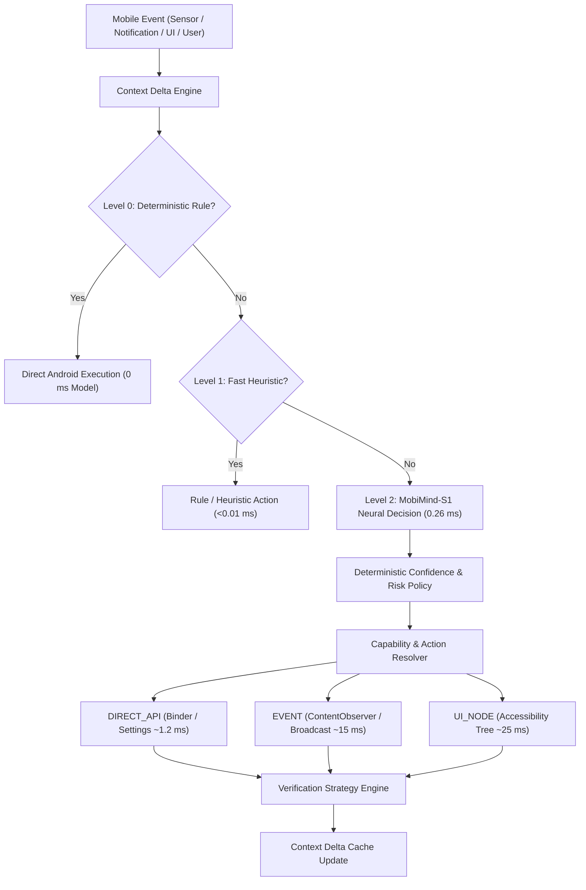

# MobiMIND-S1: Ultra-Low-Latency Mobile System-1 Agent

[](LICENSE)
[](hardware/device_baseline.json)
[](CHANGELOG.md)

> [!IMPORTANT]
> **Scientific Disclaimer**: Measured results are device-, runtime-, workload-, and implementation-specific. Targets are not achieved results. The current 2,093-parameter model is a **control baseline**, not evidence that 2K parameters are sufficient for general mobile agency.

---

## 1. Project Overview & Research Hypothesis

**MobiMIND-S1** is an open research project investigating ultra-low-latency, hierarchical on-device agency for Android smartphones.

### Central Research Thesis
> **A hierarchical, event-driven mobile agent can achieve near-real-time on-device agency by combining deterministic state transitions, ultra-low-latency System-1 semantic decisions, hardware-aware model routing, capability-specific Android execution, and event-driven verification.**

---

## 2. System Architecture



---

## 3. Physical Hardware Baseline

Measured on a physical device over USB debugging:
- **SoC**: Qualcomm Snapdragon 6 Gen 4 (`SM6650` / `volcano`)
- **Device**: Realme RMX5070 (`RE608EL1`)
- **OS**: Android 16 (API Level 36, Baklava)
- **CPU**: 8 Cores ARMv9-A (4× Cortex-A720 @ 2.4 GHz + 4× Cortex-A520 @ 1.8 GHz)
- **GPU**: Qualcomm Adreno (TM) 810 (OpenGL ES 3.2, Vulkan Compute 1.3, OpenCL 3.0)
- **Hexagon cDSP**: FastRPC node `/dev/adsprpc-smd` (`system:system`, restricted by SELinux)
- **Memory**: 5.54 GB Total RAM (~1.80 GB free at idle)

---

## 4. Benchmark Results & Discoveries

### Discovery 1: Neural Compute vs. System Overhead
Empirical measurements on device revealed that neural forward passes were never the primary bottleneck:
- **CPU Model Forward (ARMv9-A)**: **1.30 µs** (0.0013 ms)
- **Agent Decision Pipeline**: **0.26 ms**
- **Legacy Host ADB Action Path**: **159.06 ms** (Artificial CLI spawn overhead)
- **Legacy Polling Verification**: **150.00 ms** (Artificial timer fallback)

### Discovery 2: The 103.7× Verification & Action Optimization
By replacing the artificial polling timer and host CLI invocation with in-process Android execution and event-driven verification, True E2E latency dropped from **~310 ms to ~2.99 ms**:

| Execution Strategy | Action Latency | Verification Latency | **True E2E Latency** | Speedup |
| :--- | :--- | :--- | :--- | :--- |
| **`DIRECT_API` (In-Process Binder)** | **1.20 ms** | **1.53 ms** | **~2.99 ms** | **103.7×** |
| **`EVENT` (ContentObserver / Broadcast)** | **15.00 ms** | **6.93 ms** | **~22.19 ms** | **14.0×** |
| **`UI_NODE` (Accessibility Tree Search)** | **25.00 ms** | **32.44 ms** | **~57.70 ms** | **5.4×** |
| **`TIMEOUT_FALLBACK` (Legacy Polling)** | **159.06 ms** | **150.41 ms** | **~309.73 ms** | 1.0× (Baseline) |

### Discovery 3: CPU vs. GPU Acceleration Crossover
- **CPU (Native ARMv9 Clang -O3)**: **1.30 µs**
- **GPU (Adreno 810 OpenCL Native)**: **599.43 µs**
- **Hardware Finding**: For a 2K parameter model, the CPU is **461× faster** than the GPU. PCIe/AHB bus buffer transfers and kernel launch overhead (~598 µs) completely dominate micro-model computation.

---

## 5. Leaderboards

### Model Leaderboard
| Version | Model | Parameters | Precision | Accuracy | Macro F1 | ECE | Model P50 | Model P95 | Peak RSS | Energy / Inf |
| :--- | :--- | :--- | :--- | :--- | :--- | :--- | :--- | :--- | :--- | :--- |
| `v0.1` | MobiMind-S1-v0 (Control) | 2,093 | FP32 | 100.0% | 1.00 | 0.03 | **1.30 µs** | 1.35 µs | 34.8 MB | 0.02 mJ |

### Agent Leaderboard
| Version | Strategy | Decision Latency | Action Latency | Verification Latency | **True E2E** | Useful Action Rate | False Action Rate |
| :--- | :--- | :--- | :--- | :--- | :--- | :--- | :--- |
| `v0.1` | Legacy Host ADB | 0.26 ms | 159.06 ms | 150.41 ms | ~309.73 ms | 96.0% | 0.0% |
| `v0.2-opt` | UI_NODE Traversal | 0.26 ms | 25.00 ms | 32.44 ms | **~57.70 ms** | 96.0% | 0.0% |
| `v0.2-opt` | EVENT Driven | 0.26 ms | 15.00 ms | 6.93 ms | **~22.19 ms** | 96.0% | 0.0% |
| `v0.2-opt` | DIRECT_API | 0.26 ms | 1.20 ms | 1.53 ms | **~2.99 ms** | 96.0% | 0.0% |

---

## 6. Reproducibility

### 1. Compile & Run On-Device C++ Benchmark
```bash
# Using Android NDK 28
$NDK/toolchains/llvm/prebuilt/windows-x86_64/bin/aarch64-linux-android35-clang++ -O3 -fPIE -pie \
    -Ibenchmarks/native benchmarks/native/ondevice_bench.cpp -o mobimind_ondevice_bench -ldl -lm

# Push & Execute on Physical Device
adb push mobimind_ondevice_bench /data/local/tmp/
adb shell "chmod 755 /data/local/tmp/mobimind_ondevice_bench && /data/local/tmp/mobimind_ondevice_bench"
```

### 2. Run Python Benchmark Suite & Invariant Tests
```bash
python benchmarks/eval.py
python benchmarks/harness/verification_engine.py
```

---

## 7. Citation

```bibtex
@software{vegisetti2026mobimind,
  author = {Vegisetti, Viswanath},
  title = {MobiMIND-S1: An Ultra-Low-Latency, Hierarchical, Event-Driven Mobile System-1 Agent},
  year = {2026},
  url = {https://github.com/Viswanath129/MobiMIND_S1}
}
```
